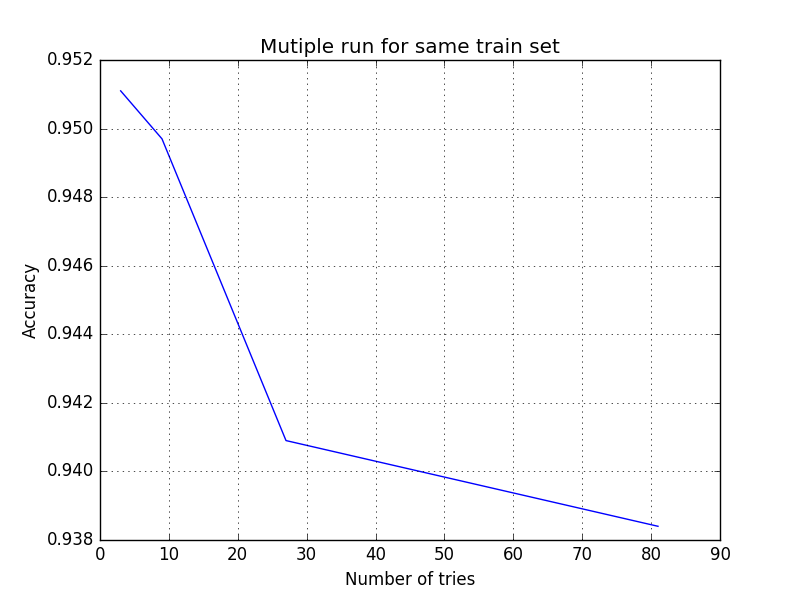

Experimentation with Neural Network
===================================

This is a very simple Artificial Neural Network created for recognition of hand
written number. This is inspired from the book Make Your Own Neural Network By
Tariq Rashid.

You need to download full datasets from mnsit for seeing actual implementaion ,
you might also use the data in the repo but it is very small, it is meant to
check if your `ANN` is working the way it is suppose to be.

I have used `python 2.7` for making this ANN, you can also use the same, the
requirements are listed in the file `requirement.txt`, you can either install
it in the virtualenv or use a Docker container or system wide install.

After installing all the dependency you can directly run:

    `pyhton train_and_work.py`

You should see something like:

    

Scorecard is just a way to test the accuracy of the ANN, I have used small datasets to test it, you can always replace it with the original dataset.

    `python scorecard.py`

I have done few analysis over the ANN , like what happen when you train a ANN multiple times with the same data.

    

 and  I took the liberty to add some visualization to it. FYI on my 4 GIGS machine it took around 40-60 min to produce the output.

    

What if I increase the `learning rate` of the ANN and then query well you certainly get surprising result.

    `python vary_learning_rate.py`

This gives:

    

and you can plot it:

    

## Findings

 When you train ANN multiple times and like huge number of times it becomes very specific to that datatset and when you test it with different dataset , the efficiency goes down.

 It's just like when human being get obsessed with certain topic or certain things they want it in that particular way.

Happy Hacking!
